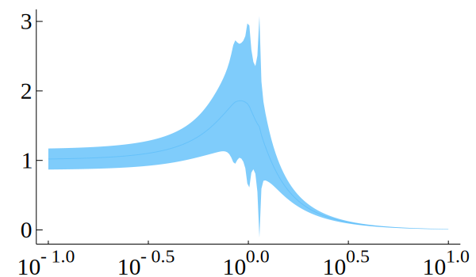

# MonteCarloMeasurements

[](https://travis-ci.org/baggepinnen/MonteCarloMeasurements.jl)
[](https://codecov.io/gh/baggepinnen/MonteCarloMeasurements.jl)

This package provides three types `Particles`, `StaticParticles` and `WeightedParticles`, all `<: Real`, that represent a distribution of a floating point number, kind of like the type `Measurement` from [Measurements.jl](https://github.com/JuliaPhysics/Measurements.jl). The difference compared to a `Measurement` is that `Particles` represent the distribution using a vector of unweighted particles, and can thus represent arbitrary distributions and handles nonlinear uncertainty propagation well. Functions like `f(x) = x²` or `f(x) = sign(x)` at `x=0`, are not handled well using linear uncertainty propagation ala [Measurements.jl](https://github.com/JuliaPhysics/Measurements.jl). The goal is to have a number of this type behave just as any other number while partaking in calculations. After a calculation, the `mean`, `std` etc. can be extracted from the number using the corresponding functions. `Particles` also interact with Distributions.jl, so that you can call, e.g., `Normal(p)` and get back a `Normal` type from distributions or `fit(Gamma, p)` to get a `Gamma`distribution. Particles can also be iterated, asked for `maximum/minimum`, `quantile` etc. If particles are plotted with `plot(p)`, a histogram is displayed. This requires Plots.jl.

## Basic Examples
```julia
using MonteCarloMeasurements, Distributions
using MonteCarloMeasurements: ±

julia> 1 ± 0.1
(500 Particles{Float64,500}: 1.001 ± 0.1)

julia> p = StaticParticles(100)
(100 StaticParticles: -0.006 ± 1.069)

julia> std(p)
1.0687859218804316

julia> var(p)
1.142303346809804

julia> mean(p)
-0.0063862728919496315

julia> f = x -> 2x + 10
#104 (generic function with 1 method)

julia> 9.6 < f(p) < 10.4 # Comparisons are using the mean
true

julia> f(p) ≈ 10 # ≈ determines if f(p) is within 2σ of 10
true

julia> f(p) ≲ 15 # ≲ (\lesssim) tests if f(p) is significantly less than 15
true

julia> Normal(f(p)) # Fits a normal distribution
Normal{Float64}(μ=9.9872274542161, σ=2.1375718437608633)

julia> fit(Normal, f(p)) # Same as above
Normal{Float64}(μ=9.9872274542161, σ=2.1268571304548938)

julia> Particles(100, Uniform(0,2)) # A distribution can be supplied
(100 Particles{Float64,100}: 1.008 ± 0.58)

julia> Particles(100, MvNormal(2,1)) # Multivariate create vectors of correlated particles
2-element Array{Particles{Float64,100},1}:
 (100 Particles{Float64,100}: 0.103 ± 0.975)
 (100 Particles{Float64,100}: 0.008 ± 1.024)
```

## Why
Convenience. Also, the benefit of using this number type instead of manually calling a function `f` with perturbed inputs is that, at least in theory, each intermediate operation on a `Particles` can exploit SIMD, since it's performed over a vector. If the function `f` is called several times, however, the compiler might not be smart enough to SIMD the entire thing. Further, any dynamic dispatch is only paid for once, whereas it would be paid for `N` times if doing things manually. The same goes for calculations that are done on regular input arguments without uncertainty, these will only be done once for `Particles` whereas they will be done `N` times if you repeatedly call `f`. One could perhaps also make an argument for cache locality being favorable for the `Particles` type, but I'm not sure this holds for all examples. A benchmark example (more further down)
```julia
using BenchmarkTools
A = [Particles(1000) for i = 1:3, j = 1:3]
B = similar(A, Float64)
@btime qr($A)
  119.243 μs (257 allocations: 456.58 KiB)
@btime foreach(_->qr($B), 1:1000)
  3.916 ms (4000 allocations: 500.00 KiB)
```
that's about a 30-fold reduction in time, and the repeated `qr` didn't even store or handle the statistics of the result.
The type `StaticParticles` contains a statically sized, stack-allocated vector from StaticArrays.jl. This type is suitable if the number of particles is small, say < 500 ish (but expect long compilation times if > 100, especially on julia < v1.1).
```julia
A = [StaticParticles(100) for i = 1:3, j = 1:3]
B = similar(A, Float64)
@btime qr($(copy(A)))
  8.392 μs (16 allocations: 18.94 KiB)
@btime map(_->qr($B), 1:100);
  690.590 μs (403 allocations: 50.92 KiB)
# Wow that's over 80 times faster
# Bigger matrix
A = [StaticParticles(100) for i = 1:30, j = 1:30]
B = similar(A, Float64)
@btime qr($(copy(A)))
  1.823 ms (99 allocations: 802.63 KiB)
@btime map(_->qr($B), 1:100);
  75.068 ms (403 allocations: 2.11 MiB)
# 40 times faster
```
`StaticParticles` allocate much less memory than regular `Partricles`, but are more stressful for the compiler to handle.

## Constructors
The most basic constructor of `Particles` acts more or less like `randn(N)`, i.e., it creates a particle cloud with distribution `Normal(0,1)`. To create a particle cloud with distribution `Normal(μ,σ)`, you can call `μ + σ*Particles(N)`, or `Particles(N, Normal(μ,σ))`. This last constructor works with any distribution from which one can sample.
One can also call (`Particles/StaticParticles`)
- `Particles(v::Vector)` pre-sampled particles
- `Particles(N = 500, d::Distribution = Normal(0,1))` samples `N` particles from the distribution `d`.
- We don't export the ± operator (`\pm`) so as to not mess with [Measurements.jl](https://github.com/JuliaPhysics/Measurements.jl), but you can import it by `import MonteCarloMeasurements.±`. We then have `μ ± σ = μ + σ*Particles(DEFAUL_NUM_PARTICLES)`, where the global constant `DEFAUL_NUM_PARTICLES = 500`. You can change this if you would like, or simply define your own `±` operator like `±(μ,σ) = μ + σ*Particles(my_default_number, my_default_distribution)`. The upside-down operator ∓ (`\mp`) instead creates a `StaticParticles(100)`.

**Common univariate distributions are sampled systematically**, meaning that a single random number is drawn and used to seed the sample. This will reduce the variance of the sample. If this is not desired, call `Particles(N, [d]; systematic=false)` The systematic sample can maintain its originally sorted order by calling `Particles(N, permute=false)`, but the default is to permute the sample so as to not have different `Particles` correlate strongly with each other.


## Multivariate particles
The constructors can be called with multivariate distributions, returning `v::Vector{Particle}` where particles are sampled from the desired multivariate distribution. Once `v` is propagated through a function `v2 = f(v)`, the results can be analyzed by asking for `mean(v2)` and `cov(v2)`, or by fitting a multivariate distribution, e.g., `MvNormal(v2)`.

A `v::Vector{Particle}` can be converted into a `Matrix` by calling `Matrix(v)` and this will have a size of `N × dim`. You can also index into `v` like it was already a matrix.

Broadcasting the ±/∓ operators works as you would expect, `zeros(3) .± 1` gives you a three-vector of independent particles, so does `zeros(3) .+ Particles.(N)`.

Independent multivariate systematic samples can be created using the function `outer_product` or the non-exported operator ⊗ (`\otimes`).

## Plotting
An instance of `p::Particles` can be plotted using `plot(p)`, that creates a histogram by default. If [`StatsPlots.jl`](https://github.com/JuliaPlots/StatsPlots.jl) is available, one can call `density(p)` to get a slightly different visualization. Vectors of particles can be plotted using one of
- `errorbarplot(x,y,[q=0.025])`: `q` determines the quantiles, set to `0` for max/min.
- `mcplot(x,y)`: Plots all trajectories
- `ribbonplot(x,y,[k=2])`: Plots with `k` standard deviations shaded area around mean.


Below is an example using [ControlSystems.jl](https://github.com/JuliaControl/ControlSystems.jl)
```julia
using ControlSystems, MonteCarloMeasurements, StatsPlots
import MonteCarloMeasurements: ±

p = 1 ± 0.1
ζ = 0.3 ± 0.1
ω = 1 ± 0.1
G = tf([p*ω], [1, 2ζ*ω, ω^2]) # Transfer function with uncertain parameters

dc = dcgain(G)[]
# 500 Particles: 1.012 ± 0.149
density(dc, title="Probability density of DC-gain")
```

```julia
w = exp10.(LinRange(-1,1,200)) # Frequency vector
mag, phase = bode(G,w) .|> vec

errorbarplot(w,mag, yscale=:log10, xscale=:log10)
```

```julia
mcplot(w,mag, yscale=:log10, xscale=:log10, alpha=0.2)
```

```julia
ribbonplot(w,mag, yscale=:identity, xscale=:log10, alpha=0.2)
```


### Control systems benchmark
```julia
using MonteCarloMeasurements, ControlSystems, BenchmarkTools, Printf
w  = exp10.(LinRange(-1,1,200)) # Frequency vector
p  = 1 ± 0.1
ζ  = 0.3 ± 0.1
ω  = 1 ± 0.1
G  = tf([p*ω], [1, 2ζ*ω, ω^2])
t1 = @belapsed bode($G,$w)
p  = 1
ζ  = 0.3
ω  = 1
G  = tf([p*ω], [1, 2ζ*ω, ω^2])
t2 = @belapsed bode($G,$w)

@printf("Time with 500 particles: %16.4fms \nTime with regular floating point: %7.4fms\n500×floating point time: %16.4fms\nSpeedup factor: %22.1fx\n", 1000*t1, 1000*t2, 1000*500t2, 500t2/t1)
  # Time with 500 particles:          14.9095ms
  # Time with regular floating point:  0.5517ms
  # 500×floating point time:         275.8640ms
  # Speedup factor:                   18.5x
```

## Differential Equations
[The tutorial](http://juliadiffeq.org/DiffEqTutorials.jl/html/type_handling/uncertainties.html) for solving differential equations using `Measurement` works for `Particles` as well. In the second pendulum example, I had to call `solve(..., dt=0.01, adaptive=false)`, otherwise the solver tried to estimate a suitable `dt` using the uncertain state, which created some problems.


## Overloading a new function
If a method for `Particles` is not implemented for your function `yourfunc` in module `Mod`, the pattern looks like this
```julia
f = nameof(yourfunc)
for ParticlesType in (:Particles, :StaticParticles)
  @eval function (Mod.$f)(p::$ParticlesType)
      $ParticlesType(map($f, p.particles))
  end
end
```
This defines the one-argument method for both `Particles` and `StaticParticles`. For two-argument methods, see [the source](https://github.com/baggepinnen/MonteCarloMeasurements.jl/blob/master/src/particles.jl#L80). If the function is from base or stdlib, you can just add it to the appropriate list in the source and submit a PR :)

### ℝⁿ → ℝⁿ functions
These functions do not work with `Particles` out of the box. Special cases are currently implemented for
- `exp : ℝ(n×n) → ℝ(n×n)`   exponential matrix

The function `ℝⁿ2ℝⁿ_function(f::Function, p::AbstractArray{T})` applies `f : ℝⁿ → ℝⁿ` to an array of particles.

### ℂ → ℂ functions
These functions do not work with `Particles` out of the box. Special cases are currently implemented for
- `sqrt`

The function `ℂ2ℂ_function(f::Function, p::AbstractArray{T})` applies `f : ℂ → ℂ ` to `z::Complex{<:AbstractParticles}`.

## Weighted particles
The type `WeightedParticles` contains an additional field `logweights`. You may modify this field as you see fit, e.g.
```julia
reweight(p,y) = (p.logweights .+= logpdf.(Normal(0,1), y .- p.particles))
```
where `y` would be some measurement. After this you can resample the particles using `resample!(p)`. This performs a systematic resample with replacement, where each particle is sampled proportionally to `exp.(logweights)`.

## Monte-Carlo simulation by `map/pmap`
Some functions will not work when the input arguments are of type `Particles`. For this kind of function, we provide a fallback onto a traditional `map(f,p.particles)`. The only thing you need to do is to decorate the function call with the macro `@bymap` like so:
```julia
f(x) = 3x^2
p = 1 ± 0.1
r = @bymap f(p)
```
We further provide the macro `@bypmap` which does exactly the same thing, but with a `pmap` (parallel map) instead, allowing you to run several invocations of `f` in a distributed fashion.

These macros will map the function `f` over each element of `p::Particles{T,N}`, such that `f` is only called with arguments of type `T`, e.g., `Float64`. This handles arguments that are multivaiate particles `<: Vector{<:AbstractParticles}` as well.

These macros will typically be slower than calling `f(p)`, but allow for Monte-Carlo simulation of things like calls to `Optim.optimize` etc., which fail if called like `optimize(f,p)`. If `f` is very expensive, `@bypmap` might prove prove faster than calling `f` with `p`, it's worth a try. The usual caveats for distributed computing applies, all code must be loaded on all workers etc.
