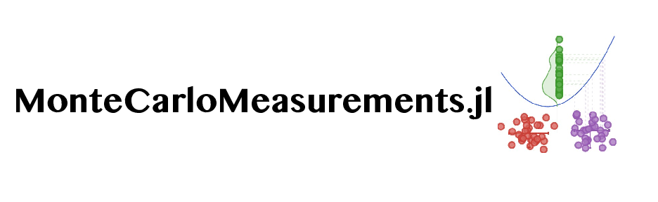
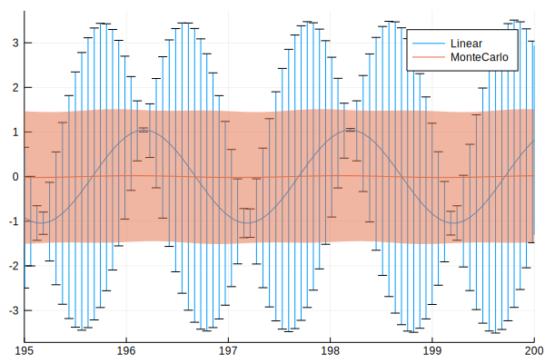

[](https://travis-ci.org/baggepinnen/MonteCarloMeasurements.jl)
[](https://codecov.io/gh/baggepinnen/MonteCarloMeasurements.jl)


This package facilitates nonlinear [uncertainty propagation](https://en.wikipedia.org/wiki/Propagation_of_uncertainty) by means of Monte-Carlo methods. A variable or parameter might be associated with uncertainty if it is measured or otherwise estimated from data. We provide three core types to represent uncertainty: `Particles`, `StaticParticles` and `WeightedParticles`, all `<: Real`. (The name "Particles" comes from the [particle-filtering](https://en.wikipedia.org/wiki/Particle_filter) literature.) These types all form a Monte-Carlo approximation of the distribution of a floating point number, i.e., the distribution is represented by samples/particles. Correlated quantities are handled as well, see [multivariate particles](https://github.com/baggepinnen/MonteCarloMeasurements.jl#multivariate-particles) below.

The goal of the package is similar to that of [Measurements.jl](https://github.com/JuliaPhysics/Measurements.jl), to propagate the uncertainty from input of a function to the output. The difference compared to a `Measurement` is that `Particles` represent the distribution using a vector of unweighted particles, and can thus represent arbitrary distributions and handle nonlinear uncertainty propagation well. Functions like `f(x) = x²` or `f(x) = sign(x)` at `x=0`, are examples that are not handled well using linear uncertainty propagation ala [Measurements.jl](https://github.com/JuliaPhysics/Measurements.jl). MonteCarloMeasurements also support correlations between quantities.

A number of type `Particles` behaves just as any other `Number` while partaking in calculations. After a calculation, an approximation to the **complete distribution** of the output is captured and represented by the output particles. `mean`, `std` etc. can be extracted from the particles using the corresponding functions. `Particles` also interact with [Distributions.jl](https://github.com/JuliaStats/Distributions.jl), so that you can call, e.g., `Normal(p)` and get back a `Normal` type from distributions or `fit(Gamma, p)` to get a `Gamma`distribution. Particles can also be iterated, asked for `maximum/minimum`, `quantile` etc. If particles are plotted with `plot(p)`, a histogram is displayed. This requires Plots.jl. A kernel-density estimate can be obtained by `density(p)` is StatsPlots.jl is loaded.

Below, we show an example where an input uncertainty is propagated through `σ(x)`


In the figure above, we see the probability-density function of the input `p(x)` depicted on the x-axis. The density of the output `p(y) = f(x)` is shown on the y-axis. Linear uncertainty propagation does this by linearizing `f(x)` and using the equations for an affine transformation of a Gaussian distribution, and hence produces a Gaussian approximation to the output density. The particles form a sampled approximation of the input density `p(x)`. After propagating them through `f(x)`, they form a sampled approximation to `p(y)` which correspond very well to the true output density, even though only 20 particles were used in this example. The figure can be reproduced by `examples/transformed_densities.jl`.

For a comparison of uncertainty propagation and nonlinear filtering, see [notes](https://github.com/baggepinnen/MonteCarloMeasurements.jl#comparison-to-nonlinear-filtering) below.

# Basic Examples
```julia
using MonteCarloMeasurements, Distributions

julia> 1 ± 0.1
(500 Particles{Float64,500}: 1.001 ± 0.1)

julia> p = StaticParticles(100)
(100 StaticParticles: -0.006 ± 1.069)

julia> std(p)
1.0687859218804316

julia> var(p)
1.142303346809804

julia> mean(p)
-0.0063862728919496315

julia> f = x -> 2x + 10
#104 (generic function with 1 method)

julia> f(p) ≈ 10 # ≈ determines if f(p) is within 2σ of 10
true

julia> f(p) ≲ 15 # ≲ (\lesssim) tests if f(p) is significantly less than 15
true

julia> Normal(f(p)) # Fits a normal distribution
Normal{Float64}(μ=9.9872274542161, σ=2.1375718437608633)

julia> fit(Normal, f(p)) # Same as above
Normal{Float64}(μ=9.9872274542161, σ=2.1268571304548938)

julia> Particles(100, Uniform(0,2)) # A distribution can be supplied
(100 Particles{Float64,100}: 1.008 ± 0.58)

julia> Particles(1000, MvNormal([0,0],[2. 1; 1 4])) # A multivariate distribution will cause a vector of correlated particles
2-element Array{Particles{Float64,1000},1}:
 (1000 Particles: 0.00466 ± 1.42)
 (1000 Particles: 0.0819 ± 2.0)
```

# Why a package
Convenience. Also, the benefit of using this number type instead of manually calling a function `f` with perturbed inputs is that, at least in theory, each intermediate operation on `Particles` can exploit SIMD, since it's performed over a vector. If the function `f` is called several times, however, the compiler might not be smart enough to SIMD the entire thing. Further, any dynamic dispatch is only paid for once, whereas it would be paid for `N` times if doing things manually. The same goes for calculations that are done on regular input arguments without uncertainty, these will only be done once for `Particles` whereas they will be done `N` times if you repeatedly call `f`. One could perhaps also make an argument for cache locality being favorable for the `Particles` type, but I'm not sure this holds for all examples. Below, we show a small benchmark example (additional benchmarks further down) where we calculate a QR factorization of a matrix using `Particles` and compare it to manually doing it many times
```julia
using BenchmarkTools
A = [Particles(1000) for i = 1:3, j = 1:3]
B = similar(A, Float64)
@btime qr($A)
  119.243 μs (257 allocations: 456.58 KiB)
@btime foreach(_->qr($B), 1:1000) # Manually do qr 1000 times
  3.916 ms (4000 allocations: 500.00 KiB)
```
that's about a 30-fold reduction in time, and the repeated `qr` didn't even bother to sample new input points or store and handle the statistics of the result.
The type `StaticParticles` contains a statically sized, stack-allocated vector from [StaticArrays.jl](https://github.com/JuliaArrays/StaticArrays.jl). This type is suitable if the number of particles is small, say < 500 ish (but expect long compilation times if > 100, especially on julia < v1.1).
```julia
A = [StaticParticles(100) for i = 1:3, j = 1:3]
B = similar(A, Float64)
@btime qr($(copy(A)))
  8.392 μs (16 allocations: 18.94 KiB)
@btime map(_->qr($B), 1:100);
  690.590 μs (403 allocations: 50.92 KiB)
# Wow that's over 80 times faster
# Bigger matrix
A = [StaticParticles(100) for i = 1:30, j = 1:30]
B = similar(A, Float64)
@btime qr($(copy(A)))
  1.823 ms (99 allocations: 802.63 KiB)
@btime map(_->qr($B), 1:100);
  75.068 ms (403 allocations: 2.11 MiB)
# 40 times faster
```
`StaticParticles` allocate much less memory than regular `Particles`, but are more stressful for the compiler to handle.

# Constructors
The most basic constructor of `Particles` acts more or less like `randn(N)`, i.e., it creates a particle cloud with distribution `Normal(0,1)`. To create a particle cloud with distribution `Normal(μ,σ)`, you can call `μ + σ*Particles(N)`, or `Particles(N, Normal(μ,σ))`. This last constructor works with any distribution from which one can sample.
One can also call (`Particles/StaticParticles`)
- `Particles(v::Vector)` pre-sampled particles
- `Particles(N = 500, d::Distribution = Normal(0,1))` samples `N` particles from the distribution `d`.
- The ± operator (`\pm`) (similar to [Measurements.jl](https://github.com/JuliaPhysics/Measurements.jl)). We have `μ ± σ = μ + σ*Particles(DEFAUL_NUM_PARTICLES)`, where the global constant `DEFAUL_NUM_PARTICLES = 500`. You can change this if you would like, or simply define your own `±` operator like `±(μ,σ) = μ + σ*Particles(my_default_number, my_default_distribution)`. The upside-down operator ∓ (`\mp`) instead creates a `StaticParticles(100)`.

**Common univariate distributions are sampled systematically**, meaning that a single random number is drawn and used to seed the sample. This will reduce the variance of the sample. If this is not desired, call `Particles(N, [d]; systematic=false)` The systematic sample can maintain its originally sorted order by calling `Particles(N, permute=false)`, but the default is to permute the sample so as to not have different `Particles` correlate strongly with each other.

Construction of `Particles` as [sigma points](https://en.wikipedia.org/wiki/Unscented_transform#Sigma_points) or by [latin hypercube sampling](https://en.wikipedia.org/wiki/Latin_hypercube_sampling) is detailed [below](https://github.com/baggepinnen/MonteCarloMeasurements.jl#sigma-points).


# Multivariate particles
The constructors can be called with multivariate distributions, returning `v::Vector{Particle}` where particles are sampled from the desired multivariate distribution. Once `v` is propagated through a function `v2 = f(v)`, the results can be analyzed by, e.g., asking for `mean(v2)` and `cov(v2)`, or by fitting a multivariate distribution, e.g., `MvNormal(v2)`.

A `v::Vector{Particle}` can be converted into a `Matrix` by calling `Matrix(v)` and this will have a size of `N × dim`. ~~You can also index into `v` like it was already a matrix.~~([This was a bad idea](https://discourse.julialang.org/t/show-for-vector-type-that-defines-matrix-getindex/23732/2?u=baggepinnen))

Broadcasting the ±/∓ operators works as you would expect, `zeros(3) .± 1` gives you a three-vector of *independent* particles, so does `zeros(3) .+ Particles.(N)`.

Independent multivariate systematic samples can be created using the function `outer_product` or the non-exported operator ⊗ (`\otimes`).

### Examples
The following example creates a vector of two `Particles`. Since they were created independently of each other, they are independent and uncorrelated and have the covariance matrix `Σ = Diagonal([1², 2²])`. The linear transform with the matrix `A` should in theory change this covariance matrix to `AΣAᵀ`, which we can verify be asking for the covariance matrix of the output particles.
```julia
julia> p = [1 ± 1, 5 ± 2]
2-element Array{Particles{Float64,500},1}:
 (500 Particles: 1.0 ± 1.0)
 (500 Particles: 4.99 ± 2.0)

julia> A = randn(2,2)
2×2 Array{Float64,2}:
  0.119307   0.791648
 -0.332829  -0.524872

julia> y = A*p
2-element Array{Particles{Float64,500},1}:
 (500 Particles: 4.07 ± 1.6)  
 (500 Particles: -2.95 ± 1.12)

julia> cov(y)
2×2 Array{Float64,2}:
  2.55287  -1.74549
 -1.74549   1.25673

julia> A*Diagonal([1^2, 2^2])*A'
2×2 Array{Float64,2}:
  2.52106  -1.70176
 -1.70176   1.21274
```
To create particles that exhibit a known covariance/correlation, use the appropriate constructor, e.g.,
```julia
julia> p = Particles(10000, MvLogNormal(MvNormal([2, 1],[2. 1;1 3])))
2-element Array{Particles{Float64,10000},1}:
 (10000 Particles: 19.2 ± 39.8)
 (10000 Particles: 13.0 ± 81.2)

julia> cov(log.(p))
2×2 Array{Float64,2}:
 1.99736  1.00008
 1.00008  3.00562

 julia> mean(log.(p))
2-element Array{Float64,1}:
 1.99659
 1.00218
```

# Sigma points
The [unscented transform](https://en.wikipedia.org/wiki/Unscented_transform#Sigma_points) uses a small number of points called *sigma points* to propagate the first and second moments of a probability density. We provide a function `sigmapoints(μ, Σ)` that creates a `Matrix` of `2n+1` sigma points, where `n` is the dimension. This can be used to initialize any kind of `AbstractParticles`, e.g.:
```julia
julia> m = [1,2]

julia> Σ = [3. 1; 1 4]

julia> p = StaticParticles(sigmapoints(m,Σ))
2-element Array{StaticParticles{Float64,5},1}:
 (5 StaticParticles: 1.0 ± 1.73) # 2n+1 = 5 particles
 (5 StaticParticles: 2.0 ± 2.0)

julia> cov(p) ≈ Σ
true

julia> mean(p) ≈ m
true
```
`sigmapoints` also accepts a `Normal/MvNormal` object as input. *Caveat:* If you are creating several one-dimensional uncertain values using sigmaopints independently, they will be strongly correlated. Use the multidimensional constructor! Example:
```julia
p = StaticParticles(sigmapoints(1, 0.1^2))               # Wrong!
ζ = StaticParticles(sigmapoints(0.3, 0.1^2))             # Wrong!
ω = StaticParticles(sigmapoints(1, 0.1^2))               # Wrong!

p,ζ,ω = StaticParticles(sigmapoints([1, 0.3, 1], 0.1^2)) # Correct
```

# Latin hypercube sampling
We do not provide functionality for [latin hypercube sampling](https://en.wikipedia.org/wiki/Latin_hypercube_sampling), rather, we show how to use the package [LatinHypercubeSampling.jl](https://github.com/MrUrq/LatinHypercubeSampling.jl) to initialize particles.
```julia
# import Pkg; Pkg.add("LatinHypercubeSampling")
using MonteCarloMeasurements, LatinHypercubeSampling
ndims  = 2
N      = 100  # Number of particles
ngen   = 2000 # How long to run optimization
X, fit = LHCoptim(N,ndims,ngen)
m, Σ   = [1,2], [2 1; 1 4] # Desired mean and covariance
particle_matrix = transform_moments(X,m,Σ)
p      = Particles(particle_matrix) # These are our LHS particles with correct moments
plot(scatter(eachcol(particles)..., title="Sample"), plot(fit, title="Fitness vs. iteration"))

julia> mean(p)
2-element Array{Float64,1}:
 1.0
 2.0

julia> cov(p)
2×2 Array{Float64,2}:
 2.0  1.0
 1.0  4.0
```
Latin hypercube sampling creates an approximately uniform sample in `ndims` dimensions. The applied transformation gives the particles the desired mean and covariance.
*Caveat:* Unfortunately, endowing the sampled latin hypercube with a desired *non-diagonal* covariance matrix destroys the latin properties for all dimensions but the first. This is less of a problem for diagonal covariance matrices provided that the latin optimizer was run sufficiently long.

 The statistics of the sample can be visualized:
```julia
using StatsPlots
corrplot(particles)
plot(density(p[1]), density(p[2]))
```
see also `examples/lhs.jl`.

# Plotting
An instance of `p::Particles` can be plotted using `plot(p)`, that creates a histogram by default. If [`StatsPlots.jl`](https://github.com/JuliaPlots/StatsPlots.jl) is available, one can call `density(p)` to get a slightly different visualization. Vectors of particles can be plotted using one of
- `errorbarplot(x,y,[q=0.025])`: `q` determines the quantiles, set to `0` for max/min. You can also specify both bounds, e.g., `q = (0.01, 0.99)`.
- `mcplot(x,y)`: Plots all trajectories
- `ribbonplot(x,y,[q=0.025])`: Plots with shaded area from quantile `q` to `1-q`. You can also specify both bounds, e.g., `q = (0.01, 0.99)`.


Below is an example using [ControlSystems.jl](https://github.com/JuliaControl/ControlSystems.jl)
```julia
using ControlSystems, MonteCarloMeasurements, StatsPlots

p = 1 ± 0.1
ζ = 0.3 ± 0.1
ω = 1 ± 0.1
G = tf([p*ω], [1, 2ζ*ω, ω^2]) # Transfer function with uncertain parameters

dc = dcgain(G)[]
# 500 Particles: 1.012 ± 0.149
density(dc, title="Probability density of DC-gain")
```

```julia
w = exp10.(LinRange(-1,1,200)) # Frequency vector
mag, phase = bode(G,w) .|> vec

errorbarplot(w,mag, yscale=:log10, xscale=:log10)
```

```julia
mcplot(w,mag, yscale=:log10, xscale=:log10, alpha=0.2)
```

```julia
ribbonplot(w,mag, yscale=:log10, xscale=:log10, alpha=0.2)
```


# Differential Equations
[The tutorial](http://tutorials.juliadiffeq.org/html/type_handling/02-uncertainties.html) for solving differential equations using `Measurement` works for `Particles` as well. A word of caution for actually using Measurements.jl in this example: while solving the pendulum on short time scales, linear uncertainty propagation works well
```julia
function sim(±, tspan, plotfun=plot!; kwargs...)

    g = 9.79 ± 0.02; # Gravitational constants
    L = 1.00 ± 0.01; # Length of the pendulum

    #Initial Conditions
    u₀ = [0 ± 0, π / 3 ± 0.02] # Initial speed and initial angle

    #Define the problem
    function simplependulum(du,u,p,t)
        θ  = u[1]
        dθ = u[2]
        du[1] = dθ
        du[2] = -(g/L) * sin(θ)
    end

    #Pass to solvers
    prob = ODEProblem(simplependulum, u₀, tspan)
    sol = solve(prob, Tsit5(), reltol = 1e-6)

    plotfun(sol.t, getindex.(sol.u, 2); kwargs...)

end

tspan = (0.0, 5)
plot()
sim(Measurements.:±, tspan, label = "Linear", xlims=(tspan[2]-5,tspan[2]))
sim(MonteCarloMeasurements.:±, tspan, label = "MonteCarlo", xlims=(tspan[2]-5,tspan[2]))
```

The mean and errorbars for both Measurements and MonteCarloMeasurements line up perfectly.

However, the uncertainty in the pendulum coefficients implies that the frequency of the pendulum oscillation is uncertain, when solving on longer time scales, this should result in the phase being completely unknown, something linear uncertainty propagation does not handle
```julia
tspan = (0.0, 200)
plot()
sim(Measurements.:±, tspan, label = "Linear", xlims=(tspan[2]-5,tspan[2]))
sim(MonteCarloMeasurements.:±, tspan, label = "MonteCarlo", xlims=(tspan[2]-5,tspan[2]))
```


This result maybe looks a bit confusing, the linear uncertainty propagation is very sure about the amplitude at certain points but not at others, whereas the Monte-Carlo approach is completely unsure. Furthermore, the linear approach thinks that the amplitude at some points is actually much higher than the staring amplitude, implying that energy somehow has been added to the system! The picture might become a bit more clear by plotting the individual trajectories of the particles
```julia
plot()
sim(Measurements.:±, tspan, label = "Linear", xlims=(tspan[2]-5,tspan[2]), l=(5,))
sim(MonteCarloMeasurements.:∓, tspan, mcplot!, label = "", xlims=(tspan[2]-5,tspan[2]), l=(:black,0.1))
```

It now becomes clear that each trajectory has a fixed amplitude, but the phase is all mixed up due to the slightly different frequencies!

# Limitations
One major limitation is functions that contain control flow, where the branch is decided by an uncertain value. Consider the following case
```julia
function negsquare(x)
    x > 0 ? x^2 : -x^2
end
p = 0 ± 1
```
Ideally, half of the particles should turn out negative and half positive when applying `negsquare(p)`. However, this will not happen as the `x > 0` is not defined for uncertain values. To circumvent this, define `negsquare` as a primitive using `register_primitive` described below. Particles will then be propagated one by one through the entire function `negsquare`. Common such functions from `Base`, such as `max/min` etc. are already registered.

Sometimes, defining a primitive function can be difficult, such as when the uncertain parameters are baked into some object. In such cases, we can call the function `unsafe_comparisons(true)`, which defines all comparison operators for uncertain values to compare using the `mean`. Note however that this enabling this is somewhat *unsafe* as this corresponds to a fallback to linear uncertainty propagation, why it's turned off by default. We also provide the macro
`@unsafe ex` to enable mean comparisons only locally in the expression `ex`.

In some cases, defining a primitive is not possible but allowing unsafe comparisons are not acceptable. One such case is functions that internally calculate eigenvalues of uncertain matrices. The eigenvalue calculation makes use of comparison operators. If the uncertainty is large, eigenvalues might change place in the sorted list of returned eigenvalues, completely ruining downstream computations. For this we recommend, in order of preference
1. Use `@bymap` defined [below](https://github.com/baggepinnen/MonteCarloMeasurements.jl#monte-carlo-simulation-by-mappmap). Applicable if all uncertain values appears as arguments to your entry function.
2. Create a `Workspace` object and call it using your entry function. Applicable if uncertain parameters appear nested in an object that is an argument to your entry function:
```julia
# desired computation: y = f(obj), obj contains uncertain parameters inside
y = with_workspace(f, obj)
# or equivalently
w = Workspace(f,obj) # This is somewhat expensive and can be reused
use_invokelatest = true # Set this to false to gain 0.1-1 ms, at the expense of world-age problems if w is created and used in the same function.
w(obj, use_invokelatest)
```
This interface is so far not tested very well and may throw strange errors. Some care has been taken to make error messages informative.
Internally, a `w::Workspace` object is created that tries to automatically construct an object identical to `obj`, but where all uncertain parameters are replaced by conventional `Real`. If the heuristics used fail, an error message is displayed detailing which method you need to implement to make it work. When called, `w` populates the internal buffer object with particle `i`, calls `f` using a `Particle`-free `obj` and stores the result in an output object at particle index  `i`. This is done for `i ∈ 1:N` after which the output is returned. Some caveats include: `Workspace` must not be created or used inside a `@generated` function.

# Overloading a new function
If a method for `Particles` is not implemented for your function `yourfunc`, the pattern looks like this
```julia
register_primitive(yourfunc)
```
This defines both a one-argument method and a multi-arg method for both `Particles` and `StaticParticles`. If you only want to define one of these, see `register_primitive_single`/`register_primitive_multi`. If the function is from base or stdlib, you can just add it to the appropriate list in the source and submit a PR :)

# Monte-Carlo simulation by `map/pmap`
Some functions will not work when the input arguments are of type `Particles`. For this kind of function, we provide a fallback onto a traditional `map(f,p.particles)`. The only thing you need to do is to decorate the function call with the macro `@bymap` like so:
```julia
f(x) = 3x^2
p = 1 ± 0.1
r = @bymap f(p)
```
We further provide the macro `@bypmap` which does exactly the same thing, but with a `pmap` (parallel map) instead, allowing you to run several invocations of `f` in a distributed fashion.

These macros will map the function `f` over each element of `p::Particles{T,N}`, such that `f` is only called with arguments of type `T`, e.g., `Float64`. This handles arguments that are multivaiate particles `<: Vector{<:AbstractParticles}` as well.

These macros will typically be slower than calling `f(p)`. If `f` is very expensive, `@bypmap` might prove prove faster than calling `f` with `p`, it's worth a try. The usual caveats for distributed computing applies, all code must be loaded on all workers etc.


## ℝⁿ → ℝⁿ functions
These functions do not work with `Particles` out of the box. Special cases are currently implemented for
- `exp : ℝ(n×n) → ℝ(n×n)`   matrix exponential
- `log : ℝ(n×n) → C(n×n)`   matrix logarithm
- `eigvals : ℝ(n×n) → C(n)` **warning**: eigenvalues are sorted, when two eigenvalues cross, this function is nondifferentiable. Eigenvalues can thus appear to have dramatically widened distributions. Make sure you interpret the result of this call in the right way.

The function `ℝⁿ2ℝⁿ_function(f::Function, p::AbstractArray{T})` applies `f : ℝⁿ → ℝⁿ` to an array of particles.

## ℂ → ℂ functions
These functions do not work with `Particles` out of the box. Special cases are currently implemented for
- `sqrt`, `exp`, `sin`, `cos`

We also provide in-place versions of the above functions, e.g.,
- `sqrt!(out, p)`, `exp!(out, p)`, `sin!(out, p)`, `cos!(out, p)`

The function `ℂ2ℂ_function(f::Function, z)` (`ℂ2ℂ_function!(f::Function, out, z)`) applies `f : ℂ → ℂ ` to `z::Complex{<:AbstractParticles}`.

# Weighted particles
The type `WeightedParticles` contains an additional field `logweights`. You may modify this field as you see fit, e.g.
```julia
reweight(p,y) = (p.logweights .+= logpdf.(Normal(0,1), y .- p.particles))
```
where `y` would be some measurement. After this you can resample the particles using `resample!(p)`. This performs a systematic resample with replacement, where each particle is sampled proportionally to `exp.(logweights)`.


# When to use what?

| Situation       | Action       |
|-----------------|--------------|
| Linear functions | Use linear uncertainty propagation, i.e., Measurements.jl |
| Highly nonlinear/discountinuous functions | Use MonteCarloMeasurements |
| Correlated quantities | Use MonteCarloMeasurements |
| Large uncertainties in input | Use MonteCarloMeasurements |
| Small uncertainties in input in relation to the curvature of the function | Use Measurements |
| Interested in low probability events / extremas  | Use MonteCarloMeasurements |
| Limited computational budget | Use Measurements or `StaticParticles` with  [`sigmapoints`](https://github.com/baggepinnen/MonteCarloMeasurements.jl#sigma-points). See benchmark below. |
| Non-Gaussian input distribution  | Use MonteCarloMeasurements |
| Calculate tail integrals accurately | This requires some form of [importance sampling](https://en.wikipedia.org/wiki/Importance_sampling#Application_to_simulation), not yet fully supported |

Due to [Jensen's inequality](https://en.wikipedia.org/wiki/Jensen%27s_inequality), linear uncertainty propagation will always underestimate the mean of nonlinear convex functions and overestimate the mean of concave functions. From wikipedia
> In its simplest form the inequality states that the convex transformation of a mean is less than or equal to the mean applied after convex transformation; it is a simple corollary that the opposite is true of concave transformations.

Linear uncertainty propagation does thus not allow you to upperbound/lowerbound the output uncertainty of a convex/concave function, and will be conservative in the reverse case.

The benchmark results below come from [`examples/controlsystems.jl`](https://github.com/baggepinnen/MonteCarloMeasurements.jl/blob/master/examples/controlsystems.jl) The benchmark consists of calculating the Bode curves for a linear system with uncertain parameters
```julia
w  = exp10.(LinRange(-1,1,200)) # Frequency vector
p  = 1 ± 0.1
ζ  = 0.3 ± 0.1
ω  = 1 ± 0.1
G  = tf([p*ω], [1, 2ζ*ω, ω^2])
t1 = @belapsed bode($G,$w)
   ⋮
```

| Benchmark | Result |
|-----------|--------|
| Time with 500 particles |           2.6953ms |
| Time with regular floating point |  0.1174ms |
| Time with Measurements |            0.1957ms |
| Time with 100 static part. |        0.5641ms |
| Time with static sigmapoints. |     0.2371ms |
| 500×floating point time |          58.6930ms |
| Speedup factor vs. Manual |        21.8x |
| Slowdown factor vs. Measurements | 13.8x |
| Slowdown static vs. Measurements |  2.9x |
| Slowdown sigma vs. Measurements |   1.2x|

## Comparison to nonlinear filtering
The table below compares methods for uncertainty propagation with their parallel in nonlinear filtering.

| Uncertainty propagation  | Dynamic filtering       | Method                 |
| -------------------------|-------------------------|------------------------|
| Measurements.jl          | Extended Kalman filter  | Linearization          |
| `Particles(sigmapoints)` | Unscented Kalman Filter | Unscented transform    |
| `Particles`              | [Particle Filter](https://github.com/baggepinnen/LowLevelParticleFilters.jl)         | Monte Carlo (sampling) |


# Examples
## [Control systems](https://github.com/baggepinnen/MonteCarloMeasurements.jl/blob/master/examples/controlsystems.jl)
This example shows how to simulate control systems (using [ControlSystems.jl](https://github.com/JuliaControl/ControlSystems.jl)
[](ControlSystems.jl)) with uncertain parameters. We calculate and display Bode diagrams, Nyquist diagrams and time-domain responses. We also illustrate how the package [ControlSystemIdentification.jl](https://github.com/baggepinnen/ControlSystemIdentification.jl) interacts with MonteCarloMeasurements to facilitate the creation and analysis of uncertain systems.

We also perform some limited benchmarks.

## [Latin Hypercube Sampling](https://github.com/baggepinnen/MonteCarloMeasurements.jl/blob/master/examples/lhs.jl)
We show how to initialize particles with LHS and how to make sure the sample gets the desired moments. We also visualize the statistics of the sample.

## [How MC uncertainty propagation works](https://github.com/baggepinnen/MonteCarloMeasurements.jl/blob/master/examples/transformed_densities.jl)
We produce the first figure in this readme and explain in visual detail how different forms of uncertainty propagation propagates a probability distribution through a nonlinear function.

## [Robust probabilistic optimization](https://github.com/baggepinnen/MonteCarloMeasurements.jl/blob/master/examples/robust_controller_opt.jl)
Here, we use MonteCarloMeasurements to perform [robust optimization](https://en.wikipedia.org/wiki/Robust_optimization). With robust and probabilistic, we mean that we place some kind of bound on a quantile of an uncertain value, or otherwise make use of the probability distribution of some value that depend on the optimized parameters.

The application we consider is optimization of a PID controller. Normally, we are interested in controller performance and robustness against uncertainty. The robustness is often introduced by placing an upper bound on the, so called, sensitivity function. When the system to be controlled is parameterized by `Particles`, we can penalize both variance in the performance measure as well as the 90:th quantile of the maximum of the sensitivity function. This example illustrates how easy it is to incorporate probabilistic constrains or cost functions in an optimization problem using `Particles`.


## [Autodiff and Robust optimization](https://github.com/baggepinnen/MonteCarloMeasurements.jl/blob/master/examples/autodiff_robust_opt.jl)
Another example using MonteCarloMeasurements to perform [robust optimization](https://en.wikipedia.org/wiki/Robust_optimization), this time with automatic differentiation. We use Optim.jl to solve a linear program with probabilistic constraints using 4 different methods, two gradient free, one first-order and one second-order method.


## Monte-Carlo sampling properties
The variance introduced by Monte-Carlo sampling has some fortunate and some unfortunate properties. It decreases as 1/N, where N is the number of particles/samples. This unfortunately means that to get half the standard deviation in your estimate, you need to quadruple the number of particles. On the other hand, this variance does not depend on the dimension of the space, which is very fortunate.

In this package, we perform [*systematic sampling*](https://arxiv.org/pdf/cs/0507025.pdf) whenever possible. This approach exhibits lower variance than standard random sampling. Below, we investigate the variance of the mean estimator of a random sample from the normal distribution. The variance of the estimate of the mean is known to decrease as 1/N
```julia
default(l=(3,))
N = 1000
svec = round.(Int, exp10.(LinRange(1, 3, 50)))
vars = map(svec) do i
  var(mean(randn(i)) for _ in 1:1000)
end
plot(svec, vars, yscale=:log10, xscale=:log10, lab="Random sampling", xlabel="\$N\$", ylabel="Variance")
plot!(svec, N->1/N, lab="\$1/N\$", l=(:dash,))
vars = map(svec) do i
  var(mean(systematic_sample(i)) for _ in 1:1000)
end
plot!(svec, vars, lab="Systematic sampling")
plot!(svec, N->1/N^2, lab="\$1/N^2\$", l=(:dash,))
```


As we can see, the variance of the standard random sampling decreases as expected. We also see that the variance for the systematic sample is considerably lower, and also scales as (almost) 1/N².

A simplified implementation of the systematic sampler is given below
```julia
function systematic_sample(N, d=Normal(0,1))
    e   = rand()/N
    y   = e:1/N:1
    map(x->quantile(d,x), y)
end
```
As we can see, a single random number is generated to seed the entire sample. The samples are then drawn deterministically from the quantile function of the distribution.

## Variational inference
See blog post by [@cscherrer](https://github.com/cscherrer) for an example of variational inference using `Particles`

https://cscherrer.github.io/post/variational-importance-sampling/
