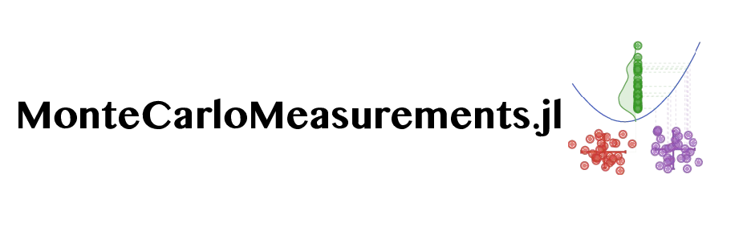

[](https://travis-ci.org/baggepinnen/MonteCarloMeasurements.jl)
[](https://codecov.io/gh/baggepinnen/MonteCarloMeasurements.jl)
[](https://baggepinnen.github.io/MonteCarloMeasurements.jl/stable)
[](https://baggepinnen.github.io/MonteCarloMeasurements.jl/latest)
[](https://arxiv.org/abs/2001.07625)


This package facilitates working with probability distributions by means of Monte-Carlo methods, in a way that allows for propagation of probability distributions through functions. This is useful for, e.g.,  nonlinear [uncertainty propagation](https://en.wikipedia.org/wiki/Propagation_of_uncertainty). A variable or parameter might be associated with uncertainty if it is measured or otherwise estimated from data. We provide two core types to represent probability distributions: `Particles` and `StaticParticles`, both `<: Real`. (The name "Particles" comes from the [particle-filtering](https://en.wikipedia.org/wiki/Particle_filter) literature.) These types all form a Monte-Carlo approximation of the distribution of a floating point number, i.e., the distribution is represented by samples/particles. **Correlated quantities** are handled as well, see [multivariate particles](https://baggepinnen.github.io/MonteCarloMeasurements.jl/stable/#Multivariate-particles-1) below.

Although several interesting use cases for doing calculations with probability distributions have popped up (see [Examples](https://baggepinnen.github.io/MonteCarloMeasurements.jl/stable/examples)), the original goal of the package is similar to that of [Measurements.jl](https://github.com/JuliaPhysics/Measurements.jl), to propagate the uncertainty from input of a function to the output. The difference compared to a `Measurement` is that `Particles` represent the distribution using a vector of unweighted particles, and can thus represent arbitrary distributions and handle nonlinear uncertainty propagation well. Functions like `f(x) = x²`, `f(x) = sign(x)` at `x=0` and long-time integration, are examples that are not handled well using linear uncertainty propagation ala [Measurements.jl](https://github.com/JuliaPhysics/Measurements.jl). MonteCarloMeasurements also support correlations between quantities.

A number of type `Particles` behaves just as any other `Number` while partaking in calculations. After a calculation, an approximation to the **complete distribution** of the output is captured and represented by the output particles. `mean`, `std` etc. can be extracted from the particles using the corresponding functions. `Particles` also interact with [Distributions.jl](https://github.com/JuliaStats/Distributions.jl), so that you can call, e.g., `Normal(p)` and get back a `Normal` type from distributions or `fit(Gamma, p)` to get a `Gamma`distribution. Particles can also be iterated, asked for `maximum/minimum`, `quantile` etc. If particles are plotted with `plot(p)`, a histogram is displayed. This requires Plots.jl. A kernel-density estimate can be obtained by `density(p)` is StatsPlots.jl is loaded.

Below, we show an example where an input uncertainty is propagated through `σ(x)`


In the figure above, we see the probability-density function of the input `p(x)` depicted on the x-axis. The density of the output `p(y) = f(x)` is shown on the y-axis. Linear uncertainty propagation does this by linearizing `f(x)` and using the equations for an affine transformation of a Gaussian distribution, and hence produces a Gaussian approximation to the output density. The particles form a sampled approximation of the input density `p(x)`. After propagating them through `f(x)`, they form a sampled approximation to `p(y)` which correspond very well to the true output density, even though only 20 particles were used in this example. The figure can be reproduced by `examples/transformed_densities.jl`.

## Quick start
```julia
using MonteCarloMeasurements, Plots
a = π ± 0.1 # Construct Gaussian uncertain parameters using ± (\pm)
# Part500(3.142 ± 0.1)
b = 2 ∓ 0.1 # ∓ (\mp) creates StaticParticles (with StaticArrays)
# SPart100(2.0 ± 0.1)
std(a)      # Ask about statistical properties
# 0.09997062445203879
sin(a)      # Use them like any real number
# Part500(1.255e-16 ± 0.0995)
plot(a)     # Plot them
b = sin.(1:0.1:5) .± 0.1; # Create multivariate uncertain numbers
plot(b)                   # Vectors of particles can be plotted
using Distributions
c = Particles(500, Poisson(3.)) # Create uncertain numbers distributed according to a given distribution
# Part500(2.896 ± 1.71)
```

For further help, see the [documentation](https://baggepinnen.github.io/MonteCarloMeasurements.jl/stable), the [examples folder](https://github.com/baggepinnen/MonteCarloMeasurements.jl/tree/master/examples) or the [arXiv paper](https://arxiv.org/abs/2001.07625).
