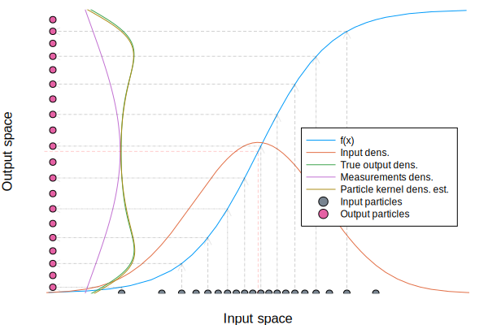

# Comparison between linear uncertainty propagation and Monte-Carlo sampling
This page will highlight some situations in which linear uncertainty propagation breaks down by showing the input density along the x-axis and the various approximations to the output density on the y-axis. The figures will be similar to the one below, but we'll leave out some of the guiding lines and particles for clarity


All examples will use Gaussian input densities since linear uncertainty propagation is only applicable in this case.

We start by defining a function that plots everything for us

```@example comparison

using MonteCarloMeasurements, Measurements, Plots, Distributions
using Measurements: value, uncertainty

function plot_dens(f, d, l, r, N=10_000; kwargs...)
    xr = LinRange(l,r,100) # x values for plotting
    yr = f.(xr)

    # Estimate the output density corresponding to the particles
    x  = Particles(N,d) # Create particles distributed according to d, sort for visualization
    yp = f(x)
    y  = yp.particles # corresponding output particles
    edges1, edges2 = Plots._hist_edges((xr,y), 30)
    histogram(fill(l, length(y)), y , bins=edges2, orientation=:h, alpha=0.4, normalize=true, lab="Particle density")

    fig = plot!(xr.-l, yr, legend=:right, xlims=(0,r-l), axis=false, grid=false, lab="f(x)", xlabel="Input space", ylabel="Output space", l=(3,:blue))
    idens = pdf.(d,xr)
    idens .*= maximum(yr)/maximum(idens)
    plot!(xr.-l,idens; lab="Input dens.", l=(:orange, ), kwargs...)


    # This is the output density as approximated by linear uncertainty propagation
    my   = f(Measurements.:±(mean(d), std(d))) # output measurement
    if uncertainty(my) == 0 # Draw a stick
        plot!([0,0+(r-l)/3], [value(my),value(my)], m=(:o,), lab="Linear Gaussian propagation")
    else
        yxr  = LinRange(value(my)-2.5uncertainty(my),value(my)+2.5uncertainty(my),100)
        dm   = Normal(value(my), uncertainty(my)) # Output density according to Measurements
        ym   = pdf.(dm,yxr)
        ym .*= 0+(r-l)/3/maximum(ym)
        plot!(0 .+ ym, yxr, lab="Linear Gaussian propagation")
    end
    fig
end
```

The first example we'll look at is the quadratic parabola. This function will be poorly approximated by a linear function around $x=0$.
```@example comparison
plot_dens(x->x^2+3, Normal(0,1), -3, 3, legend=:top)
savefig("parabola.html"); nothing # hide
```

```@raw html
<object type="text/html" data="../parabola.html" style="width:100%;height:450px;"></object>
```
as we can see, the linear method outputs a Dirac distribution (no uncertainty) at $x=0$, while there should clearly be a lot of uncertainty in the output. The histogram displays the output density as approximated by the particles. The histogram does not go below zero, and tapers off as values increase. The problem here is that the uncertainty is large in relation to the curvature of the function. As the uncertainty decreseas, the true output density becomes closer and closer to a DIrac distribution.


The next function has a discontinuity (≈ infinite curvature)
```@example comparison
plot_dens(x->sign(x)+1, Normal(0.5,1), -3, 3, legend=:bottom)
savefig("sign.html"); nothing # hide
```

```@raw html
<object type="text/html" data="../sign.html" style="width:100%;height:450px;"></object>
```
once again, linear uncertainty propagation outputs a distribution with zero uncertainty. The true output distribution has two modes since the input distribution has palces mass on both sides of the discontinuity. This is captured in the particle distribution, where most particles end up at the right side of the discontinuity, while a smaller proportion of the particles end up to the left. If the input density would have its mean at 0, half of the particles would end up in each of the output locations. Any funciton containing an if-statment where the chosen branch depends on an uncertain value falls into this category.

Next, we consider a periodic function
```@example comparison
plot_dens(x->sin(x)+2, Normal(0.5,1), -3, 3, legend=:topright)
savefig("sin.html"); nothing # hide
```

```@raw html
<object type="text/html" data="../sin.html" style="width:100%;height:450px;"></object>
```
Once again, the uncertainty is large in relation to the curvature of the function and linear uncertainty propagation places significant mass outside the interval $[-1, 1]$ which is the range of the $\sin$ function. The particle histogram respects this range. If we increase the uncertainty in the input further, the linear approximation to the function becomes increasingly worse
```@example comparison
plot_dens(x->sin(x)+2, Normal(0.5,5), -15, 15, legend=:topright)
savefig("sin_wide.html"); nothing # hide
```

```@raw html
<object type="text/html" data="../sin_wide.html" style="width:100%;height:450px;"></object>
```
