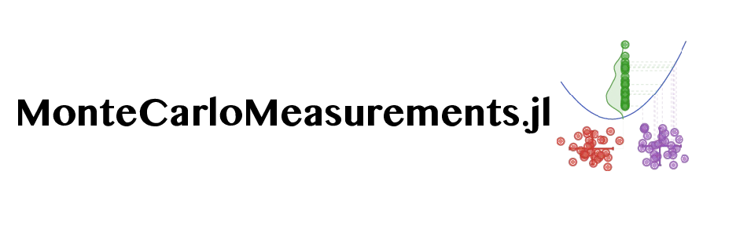
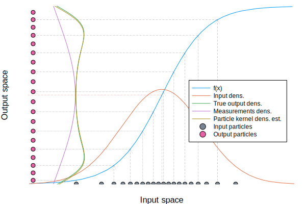
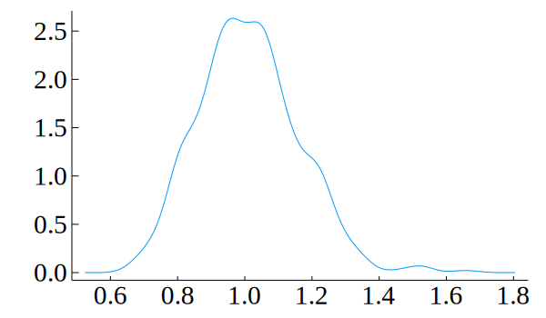
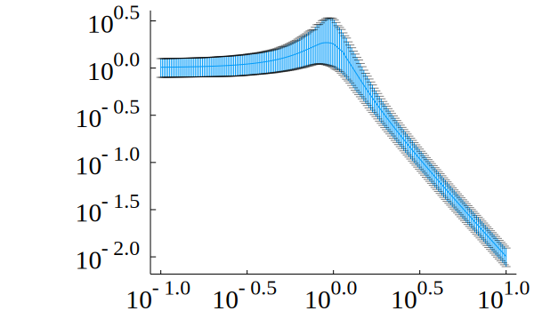
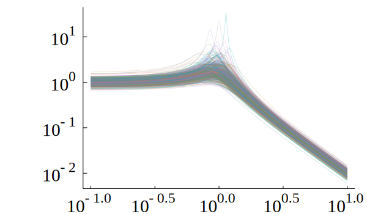
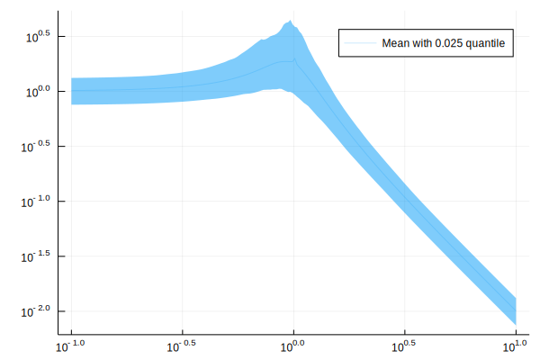

[](https://github.com/baggepinnen/MonteCarloMeasurements.jl/actions)
[](https://codecov.io/gh/baggepinnen/MonteCarloMeasurements.jl)
[](https://arxiv.org/abs/2001.07625)

# MonteCarloMeasurements

> Imagine you had a type that behaved like your standard `Float64` but it really represented a probability distribution like `Gamma(0.5)` or `MvNormal(m, S)`. Then you could call `y=f(x)` and have `y` be the probability distribution `y=p(f(x))`. This package gives you such a type. 

This package facilitates working with probability distributions as if they were regular real numbers, by means of Monte-Carlo methods, in a way that allows for propagation of probability distributions through functions. This is useful for, e.g.,  nonlinear and possibly non-Gaussian [uncertainty propagation](https://en.wikipedia.org/wiki/Propagation_of_uncertainty). A variable or parameter might be associated with uncertainty if it is measured or otherwise estimated from data. We provide two core types to represent probability distributions: `Particles` and `StaticParticles`, both `<: Real`. (The name "Particles" comes from the [particle-filtering](https://en.wikipedia.org/wiki/Particle_filter) literature.) These types all form a Monte-Carlo approximation of the distribution of a floating point number, i.e., the distribution is represented by samples/particles. **Correlated quantities** are handled as well, see [multivariate particles](https://github.com/baggepinnen/MonteCarloMeasurements.jl#multivariate-particles) below.

Although several interesting use cases for doing calculations with probability distributions have popped up (see [Examples](https://github.com/baggepinnen/MonteCarloMeasurements.jl#examples-1)), the original goal of the package is similar to that of [Measurements.jl](https://github.com/JuliaPhysics/Measurements.jl), to propagate the uncertainty from input of a function to the output. The difference compared to a `Measurement` is that `Particles` represent the distribution using a vector of unweighted particles, and can thus represent arbitrary distributions and handle nonlinear uncertainty propagation well. Functions like `f(x) = x²`, `f(x) = sign(x)` at `x=0` and long-time integration, are examples that are not handled well using linear uncertainty propagation à la [Measurements.jl](https://github.com/JuliaPhysics/Measurements.jl). MonteCarloMeasurements also support arbitrary correlations (and arbitrary dependencies such as conservation laws etc.) between variables.

A number of type `Particles` behaves just as any other `Number` while partaking in calculations. Particles also behave like a distribution,
so after a calculation, an approximation to the **complete distribution** of the output is captured and represented by the output particles.
`mean`, `std` etc. can be extracted from the particles using the corresponding functions `pmean` and `pstd`. `Particles` also interact with
[Distributions.jl](https://github.com/JuliaStats/Distributions.jl), so that you can call, e.g., `Normal(p)` and get back a `Normal` type from
distributions or `fit(Gamma, p)` to get a `Gamma`distribution. Particles can also be asked for `maximum/minimum`, `quantile` etc. using functions
with a prefix `p`, i.e., `pmaximum`. If particles are plotted with `plot(p)`, a histogram is displayed. This requires Plots.jl. A kernel-density
estimate can be obtained by `density(p)` if StatsPlots.jl is loaded. A `Measurements.Measurements` can be converted to particles by calling the
`Particles` constructor.

Below, we show an example where an input uncertainty is propagated through `σ(x)`



In the figure above, we see the probability-density function of the input `p(x)` depicted on the x-axis. The density of the output `p(y) = f(x)` is shown on the y-axis. Linear uncertainty propagation does this by linearizing `f(x)` and using the equations for an affine transformation of a Gaussian distribution, and hence produces a Gaussian approximation to the output density. The particles form a sampled approximation of the input density `p(x)`. After propagating them through `f(x)`, they form a sampled approximation to `p(y)` which corresponds very well to the true output density, even though only 20 particles were used in this example. The figure can be reproduced by `examples/transformed_densities.jl`.

For a comparison of uncertainty propagation and nonlinear filtering, see [notes](https://github.com/baggepinnen/MonteCarloMeasurements.jl#comparison-to-nonlinear-filtering) below.

# Basic Examples
```julia
using MonteCarloMeasurements, Distributions

julia> 1 ± 0.1
Particles{Float64,2000}
 1.0 ± 0.1

julia> p = StaticParticles(100)
StaticParticles{Float64,100}
 0 ± 0.999

julia> 1 ⊞ Binomial(3) # Shorthand for 1 + Particles(Binomial(1)) (\boxplus)
Particles{Int64, 2000}
 2.504 ± 0.864

julia> 3 ⊠ Gamma(1) # Shorthand for 3 * Particles(Gamma(1)) (\boxtimes)
Particles{Float64, 2000}
 2.99948 ± 3.0

julia> 2 + 0.5StaticParticles(Float32, 25) # Constructor signatures are similar to randn
StaticParticles{Float64,25}
 2.0 ± 0.498

julia> pstd(p)
0.9986403042113866

julia> pvar(p)
0.9972824571954108

julia> pmean(p)
-6.661338147750939e-17

julia> f = x -> 2x + 10
#27 (generic function with 1 method)

julia> f(p) ≈ 10 # ≈ determines if f(p) is within 2σ of 10
true

julia> f(p) ≲ 15 # ≲ (\lesssim) tests if f(p) is significantly less than 15
true

julia> Normal(f(p)) # Fits a normal distribution
Normal{Float64}(μ=10.000000000000002, σ=1.9972806084227737)

julia> fit(Normal, f(p)) # Same as above
Normal{Float64}(μ=10.000000000000002, σ=1.9872691137573264)

julia> Particles(100, Uniform(0,2)) # A distribution can be supplied
Particles{Float64,100}
 1.0 ± 0.58

julia> Particles(1000, MvNormal([0,0],[2. 1; 1 4])) # A multivariate distribution will cause a vector of correlated particles
2-element Array{Particles{Float64,1000},1}:
 -0.0546 ± 1.4
 -0.128 ± 2.0
```

# Why a package
Convenience. Also, the benefit of using this number type instead of manually calling a function `f` with perturbed inputs is that, at least in theory, each intermediate operation on `Particles` can exploit SIMD, since it's performed over a vector. If the function `f` is called several times, however, the compiler might not be smart enough to SIMD the entire thing. Further, any dynamic dispatch is only paid for once, whereas it would be paid for `N` times if doing things manually. The same goes for calculations that are done on regular input arguments without uncertainty, these will only be done once for `Particles` whereas they will be done `N` times if you repeatedly call `f`. One could perhaps also make an argument for cache locality being favorable for the `Particles` type, but I'm not sure this holds for all examples. Below, we show a small benchmark example (additional [Benchmark](@ref)) where we calculate a QR factorization of a matrix using `Particles` and compare it to manually doing it many times
```julia
using MonteCarloMeasurements, BenchmarkTools
unsafe_comparisons(true)
A = [randn() + Particles(1000) for i = 1:3, j = 1:3]
B = pmean.(A)
@btime qr($A);
  # 119.243 μs (257 allocations: 456.58 KiB)
@btime foreach(_->qr($B), 1:1000); # Manually do qr 1000 times
  # 3.916 ms (4000 allocations: 500.00 KiB)
```
that's about a 30-fold reduction in time, and the repeated `qr` didn't even bother to sample new input points or store and handle the statistics of the result.
The type `StaticParticles` contains a statically sized, stack-allocated vector from [StaticArrays.jl](https://github.com/JuliaArrays/StaticArrays.jl). This type is suitable if the number of particles is small, say < 500 ish (but expect long compilation times if > 100, especially on julia < v1.1).
```julia
A = [randn() + StaticParticles(100) for i = 1:3, j = 1:3]
B = pmean.(A)
@btime qr($(A));
  # 8.392 μs (16 allocations: 18.94 KiB)
@btime map(_->qr($B), 1:100);
  # 690.590 μs (403 allocations: 50.92 KiB)
# Over 80 times faster
# Bigger matrix
A = [randn() + StaticParticles(100) for i = 1:30, j = 1:30]
B = pmean.(A)
@btime qr($(A));
  # 1.823 ms (99 allocations: 802.63 KiB)
@btime map(_->qr($B), 1:100);
  # 75.068 ms (403 allocations: 2.11 MiB)
# 40 times faster
```
[`StaticParticles`](@ref) allocate much less memory than regular [`Particles`](@ref), but are more stressful for the compiler to handle.

# Constructors
The most basic constructor of [`Particles`](@ref) acts more or less like `randn(N)`, i.e., it creates a particle cloud with distribution `Normal(0,1)`. To create a particle cloud with distribution `Normal(μ,σ)`, you can call `μ + σ*Particles(N)`, or `Particles(N, Normal(μ,σ))`. This last constructor works with any distribution from which one can sample.
One can also call (`Particles/StaticParticles`)
- `Particles(v::Vector)` pre-sampled particles
- `Particles(N = 2000, d::Distribution = Normal(0,1))` samples `N` particles from the distribution `d`.
- The [`±`](@ref) operator (`\pm`) (similar to [Measurements.jl](https://github.com/JuliaPhysics/Measurements.jl)). We have `μ ± σ = μ + σ*Particles(DEFAULT_NUM_PARTICLES)`, where the global constant `DEFAULT_NUM_PARTICLES = 2000`. You can change this if you would like, or simply define your own `±` operator like `±(μ,σ) = μ + σ*Particles(my_default_number, my_default_distribution)`. The upside-down operator [`∓`](@ref) (`\mp`) instead creates a `StaticParticles(100)`.
- The `..` binary infix operator creates uniformly sampled particles, e.g., `2..3 = Particles(Uniform(2,3))`

**Common univariate distributions are sampled systematically**, meaning that a single random number is drawn and used to seed the sample. This will reduce the variance of the sample. If this is not desired, call `Particles(N, [d]; systematic=false)` The systematic sample can maintain its originally sorted order by calling `Particles(N, permute=false)`, but the default is to permute the sample so as to not have different `Particles` correlate strongly with each other.

Construction of `Particles` as [sigma points](https://en.wikipedia.org/wiki/Unscented_transform#Sigma_points) or by [latin hypercube sampling](https://en.wikipedia.org/wiki/Latin_hypercube_sampling) is detailed [below](https://github.com/baggepinnen/MonteCarloMeasurements.jl#sigma-points).


# Multivariate particles
The constructors can be called with multivariate distributions, returning `v::Vector{Particle}` where particles are sampled from the desired multivariate distribution. Once `v` is propagated through a function `v2 = f(v)`, the results can be analyzed by, e.g., asking for `pmean(v2)` and `pcov(v2)`, or by fitting a multivariate distribution, e.g., `MvNormal(v2)`.

A `v::Vector{Particle}` can be converted into a `Matrix` by calling `Matrix(v)` and this will have a size of `N × dim`. ~~You can also index into `v` like it was already a matrix.~~([This was a bad idea](https://discourse.julialang.org/t/show-for-vector-type-that-defines-matrix-getindex/23732/2?u=baggepinnen))

Broadcasting the ±/∓ operators works as you would expect, `zeros(3) .± 1` gives you a three-vector of *independent* particles, so does `zeros(3) .+ Particles.(N)`.

Independent multivariate systematic samples can be created using the function [`outer_product`](@ref) or the non-exported operator ⊗ (`\otimes`).

### Examples
The following example creates a vector of two `Particles`. Since they were created independently of each other, they are independent and uncorrelated and have the covariance matrix `Σ = Diagonal([1², 2²])`. The linear transform with the matrix `A` should in theory change this covariance matrix to `AΣAᵀ`, which we can verify be asking for the covariance matrix of the output particles.
```julia
julia> p = [1 ± 1, 5 ± 2]
2-element Array{Particles{Float64,2000},1}:
 1.0 ± 1.0
 5.0 ± 2.0

julia> A = randn(2,2)
2×2 Array{Float64,2}:
 -1.80898  -1.24566
  1.41308   0.196504

julia> y = A*p
2-element Array{Particles{Float64,2000},1}:
 -8.04 ± 3.1
  2.4 ± 1.5

julia> pcov(y)
2×2 Array{Float64,2}:
  9.61166  -3.59812
 -3.59812   2.16701

julia> A*Diagonal([1^2, 2^2])*A'
2×2 Array{Float64,2}:
  9.4791   -3.53535
 -3.53535   2.15126
```
To create particles that exhibit a known covariance/correlation, use the appropriate constructor, e.g.,
```julia
julia> p = Particles(2000, MvLogNormal(MvNormal([2, 1],[2. 1;1 3])))
2-element Array{Particles{Float64,2000},1}:
 19.3 ± 48.0
 11.9 ± 43.0

julia> pcov(log.(p))
2×2 Array{Float64,2}:
 1.96672  1.0016
 1.0016   2.98605

julia> pmean(log.(p))
2-element Array{Float64,1}:
 1.985378409751101
 1.000702538699887
```

# Sigma points
The [unscented transform](https://en.wikipedia.org/wiki/Unscented_transform#Sigma_points) uses a small number of points called *sigma points* to propagate the first and second moments of a probability density. We provide a function `sigmapoints(μ, Σ)` that creates a `Matrix` of `2n+1` sigma points, where `n` is the dimension. This can be used to initialize any kind of `AbstractParticles`, e.g.:
```julia
julia> m = [1,2]

julia> Σ = [3. 1; 1 4]

julia> p = StaticParticles(sigmapoints(m,Σ))
2-element Array{StaticParticles{Float64,5},1}:
 1.0 ± 1.7 # 2n+1 = 5 particles
 2.0 ± 2.0

julia> pcov(p) ≈ Σ
true

julia> pmean(p) ≈ m
true
```
[`sigmapoints`](@ref) also accepts a `Normal/MvNormal` object as input.

!!! danger "Caveat"
    If you are creating several one-dimensional uncertain values using sigmapoints independently, they will be strongly correlated. Use the multidimensional constructor! Example:
    ```julia
    p = StaticParticles(sigmapoints(1, 0.1^2))               # Wrong!
    ζ = StaticParticles(sigmapoints(0.3, 0.1^2))             # Wrong!
    ω = StaticParticles(sigmapoints(1, 0.1^2))               # Wrong!

    p,ζ,ω = StaticParticles(sigmapoints([1, 0.3, 1], 0.1^2)) # Correct
    ```

# Latin hypercube sampling
We do not provide functionality for [latin hypercube sampling](https://en.wikipedia.org/wiki/Latin_hypercube_sampling), rather, we show how to use the package [LatinHypercubeSampling.jl](https://github.com/MrUrq/LatinHypercubeSampling.jl) to initialize particles.
```julia
# import Pkg; Pkg.add("LatinHypercubeSampling")
using MonteCarloMeasurements, LatinHypercubeSampling
ndims  = 2
N      = 100  # Number of particles
ngen   = 2000 # How long to run optimization
X, fit = LHCoptim(N,ndims,ngen)
m, Σ   = [1,2], [2 1; 1 4] # Desired mean and covariance
particle_matrix = transform_moments(X,m,Σ)
p      = Particles(particle_matrix) # These are our LHS particles with correct moments
plot(scatter(eachcol(particles)..., title="Sample"), plot(fit, title="Fitness vs. iteration"))

julia> pmean(p)
2-element Array{Float64,1}:
 1.0
 2.0

julia> pcov(p)
2×2 Array{Float64,2}:
 2.0  1.0
 1.0  4.0
```
Latin hypercube sampling creates an approximately uniform sample in `ndims` dimensions. The applied transformation gives the particles the desired mean and covariance.
*Caveat:* Unfortunately, endowing the sampled latin hypercube with a desired *non-diagonal* covariance matrix destroys the latin properties for all dimensions but the first. This is less of a problem for diagonal covariance matrices provided that the latin optimizer was run sufficiently long.

 The statistics of the sample can be visualized:
```julia
using StatsPlots
corrplot(particles)
plot(density(p[1]), density(p[2]))
```
see also `examples/lhs.jl`.

# Plotting
An instance of `p::Particles` can be plotted using `plot(p)`, that creates a histogram by default. If [`StatsPlots.jl`](https://github.com/JuliaPlots/StatsPlots.jl) is available, one can call `density(p)` to get a slightly different visualization.

For arrays of particles, `plot` takes a number of keyword arguments, indicated here by the available custom plot signatures
```julia
plot(y::Array{Particles}, q=0.025; N=true, ri = true, quantile=nothing) # Applies to matrices and vectors
plot(x::Array{Particles}, y::Array{Particles}, q=0.025; points=false, quantile=nothing)
```

- `q` and `quantile` denotes the quantiles used for ribbons.
- `ri` indicates whether or not to plot ribbons.
- `N` indicates the number of sample trajectories to plot on top of the ribbon. If `N=true`, a maximum of 50 trajectories are plotted.
- `points` indicates whether or not to plot the individual particles as points. If `false`, error bars are shown instead.


Vectors of particles can also be plotted using one of the custom functions
- `errorbarplot(x,y,[q=0.025])`: `q` determines the quantiles, set to `0` for max/min. You can also specify both bounds, e.g., `q = (0.01, 0.99)`.
- `mcplot(x,y)`: Plots all trajectories
- `ribbonplot(x,y,[q=0.025]; N=true)`: Plots with shaded area from quantile `q` to `1-q`. You can also specify both bounds, e.g., `q = (0.01, 0.99)`.
- Plot recipes from [`StatsPlots.jl`](https://github.com/JuliaPlots/StatsPlots.jl) that do not work with `Particles` or vectors of `Particles` can often be made to work by converting the particles to an array, e.g., `violin(Array([1±0.5, 4±1, 2±0.1]))`.

All plots that produce an output with a ribbon also accept a keyword argument `N` that indicates a number of sample trajectories to be shown on top of the ribbon. The default `N=true` plots a maximum of 50 trajectories.


Below is an example using [ControlSystems.jl](https://github.com/JuliaControl/ControlSystems.jl)
```julia
using ControlSystems, MonteCarloMeasurements, StatsPlots

p = 1 ± 0.1
ζ = 0.3 ± 0.1
ω = 1 ± 0.1
G = tf([p*ω], [1, 2ζ*ω, ω^2]) # Transfer function with uncertain parameters

dc = dcgain(G)[]
# Part500(1.01 ± 0.147)
density(dc, title="Probability density of DC-gain")
```

```julia
w = exp10.(LinRange(-1,1,200)) # Frequency vector
mag, phase = bode(G,w) .|> vec

errorbarplot(w,mag, yscale=:log10, xscale=:log10)
```

```julia
mcplot(w,mag, yscale=:log10, xscale=:log10, alpha=0.2)
```

```julia
ribbonplot(w,mag, yscale=:log10, xscale=:log10, alpha=0.2)
```


## Makie support
!!! danger "Experimental"
    
    The support for plotting with Makie is currently experimental and at any time subject to breaking changes or removal **not** respecting semantic versioning.

Basic support for plotting with Makie exists as well, try any of the following functions with uncertain numbers
- `Makie.scatter(xs, ys)`
- `Makie.scatter(tuple.(xs, ys))`
- `Makie.band(xs, ys)`
- `Makie.band(tuple.(xs, ys); q=0.01)`
- `Makie.rangebars(tuple.(xs, ys); q=0.16)`
- `Makie.series(xs, ys)`
- `Makie.series(tuple.(xs, ys); N=5)`


# Limitations
One major limitation is functions that contain control flow, where the branch is decided by an uncertain value. Consider the following case
```julia
function negsquare(x)
    x > 0 ? x^2 : -x^2
end
p = 0 ± 1
```
Ideally, half of the particles should turn out negative and half positive when applying `negsquare(p)`. However, this will not happen as the `x > 0` is not defined for uncertain values. To circumvent this, define `negsquare` as a primitive using [`register_primitive`](@ref) described in [Overloading a new function](@ref). Particles will then be propagated one by one through the entire function `negsquare`. Common such functions from `Base`, such as `max/min` etc. are already registered.

## Comparison mode
Some functions perform checks like `if error < tol`. If `error isa Particles`, this will use a very conservative check by default by checking that all particles ∈ `error` fulfill the check. There are a few different options available for how to compare two uncertain quantities, chosen by specifying a comparison mode. The modes are chosen by `unsafe_comparisons(mode)` and the options are
- `:safe`: the default described above, throws an error if uncertain values share support.
- `:montecarlo`: slightly less conservative than `:safe`, checks if either all pairwise particles fulfill the comparison, *or* all pairwise particles fail the comparison. If some pairs pass and some fail, an error is thrown.
- `:reduction`: Reduce uncertain values to a single number, e.g. by calling `pmean` (default) before performing the comparison, never throws an error.

To sum up, if two uncertain values are compared, and they have no mutual support, then all comparison modes are equal. If they share support, `:safe` will error and `:montecarlo` will work if the all pairwise particles either pass or fail the comparison. `:reduction` will always work, but is maximally unsafe in the sense that it might not perform a meaningful check for your application.

### Calculating probability
If you would like to calculate the empirical probability that a value represented by `Particles` fulfils a condition, you may use the macro [`@prob`](@ref):
```julia
julia> p = Particles()
Particles{Float64,2000}
 0 ± 1.0

julia> @prob p < 1
0.8415

julia> mean(p.particles .< 1)
0.8415
```


# When to use what?
This table serves as a primitive guide to selecting an uncertainty propagation strategy. If you are unsure about the properties of your function, also have a look at [Comparison between linear uncertainty propagation and Monte-Carlo sampling](@ref)

| Situation       | Action       |
|-----------------|--------------|
| Linear functions | Use linear uncertainty propagation, i.e., Measurements.jl |
| Highly nonlinear/discountinuous functions | Use MonteCarloMeasurements |
| Correlated quantities | Use MonteCarloMeasurements |
| Large uncertainties in input | Use MonteCarloMeasurements |
| Small uncertainties in input in relation to the curvature of the function | Use Measurements |
| Interested in low probability events / extremas  | Use MonteCarloMeasurements / [IntervalArithmetic.jl](https://github.com/JuliaIntervals/IntervalArithmetic.jl)|
| Limited computational budget | Use Measurements or [`StaticParticles`](@ref) with [`sigmapoints`](https://github.com/baggepinnen/MonteCarloMeasurements.jl#sigma-points). See benchmark below. |
| Non-Gaussian input distribution  | Use MonteCarloMeasurements |
| Calculate tail integrals accurately | This requires some form of [importance sampling](https://en.wikipedia.org/wiki/Importance_sampling#Application_to_simulation), not yet fully supported |

Due to [Jensen's inequality](https://en.wikipedia.org/wiki/Jensen%27s_inequality), linear uncertainty propagation will always underestimate the mean of nonlinear convex functions and overestimate the mean of concave functions. From wikipedia
> In its simplest form the inequality states that the convex transformation of a mean is less than or equal to the mean applied after convex transformation; it is a simple corollary that the opposite is true of concave transformations.

Linear uncertainty propagation does thus not allow you to upperbound/lowerbound the output uncertainty of a convex/concave function, and will be conservative in the reverse case.

## Benchmark

The benchmark results below comes from [`examples/controlsystems.jl`](https://github.com/baggepinnen/MonteCarloMeasurements.jl/blob/master/examples/controlsystems.jl) The benchmark consists of calculating the Bode curves for a linear system with uncertain parameters
```julia
w  = exp10.(LinRange(-1,1,200)) # Frequency vector
p  = 1 ± 0.1
ζ  = 0.3 ± 0.1
ω  = 1 ± 0.1
G  = tf([p*ω], [1, 2ζ*ω, ω^2])
t1 = @belapsed bode($G,$w)
   ⋮
```


| Benchmark | Result |
|-----------|--------|
| Time with 500 particles |           1.3632ms |
| Time with regular floating point |  0.0821ms |
| Time with Measurements |            0.1132ms |
| Time with 100 static part. |        0.2375ms |
| Time with static sigmapoints. |     0.0991ms |
| 500×floating point time |          41.0530ms |
| Speedup factor vs. Manual |        30.1x |
| Slowdown factor vs. Measurements | 12.0x |
| Slowdown static vs. Measurements |  2.1x |
| Slowdown sigma vs. Measurements |   0.9x|

The benchmarks show that using `Particles` is much faster than doing the Monte-Carlo sampling manually. We also see that we're about 12 times slower than linear uncertainty propagation with Measurements.jl if we are using standard `Particles`, `StaticParticles` are within a factor of 2 of Measurements and `StaticParticles` with [`sigmapoints`](@ref) are actually 10% faster than Measurements (this is because 7 sigmapoints fit well into two of the processors SIMD registers, making the extra calculations very cheap).


## Comparison to nonlinear filtering
The table below compares methods for uncertainty propagation with their parallel in nonlinear filtering.

| Uncertainty propagation  | Dynamic filtering       | Method                 |
| -------------------------|-------------------------|------------------------|
| Measurements.jl          | Extended Kalman filter  | Linearization          |
| `Particles(sigmapoints)` | Unscented Kalman Filter | Unscented transform    |
| `Particles`              | [Particle Filter](https://github.com/baggepinnen/LowLevelParticleFilters.jl)         | Monte Carlo (sampling) |


# Citing
See [CITATION.bib](https://github.com/baggepinnen/MonteCarloMeasurements.jl/blob/master/CITATION.bib)

ArXiv article [MonteCarloMeasurements.jl: Nonlinear Propagation of Arbitrary Multivariate Distributions by means of Method Overloading](https://arxiv.org/abs/2001.07625)
